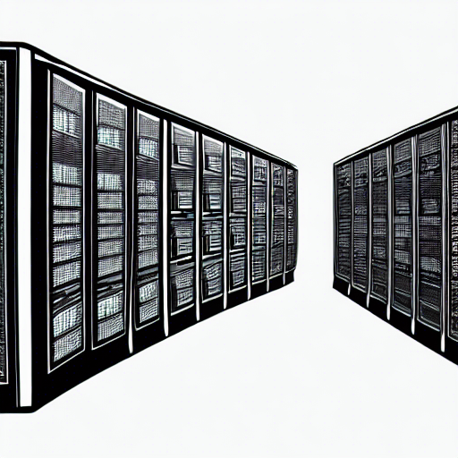

## Our vision

Technology is all about imagining what can be instead of what is. In an ever-changing world no solution is final; instead it evolves together with the ecosystem in which it exists. Any healthy ecosystem evolves over time -- the speed may vary, but it is under constant change. Because of this, solutions must be flexible and adaptable to changing requirements.

&nbsp;

## About Us

Using best of class technology we design and implement services that evolve alongside the problem in order to stand the test of time.

Developing new solutions to serve emerging needs or integrating pre-existing services to unlock their true potential: innovation is never over.

From small-scale integration between local devices to large-scale systems that require high efficiency and performance: we got it covered.

We have over 10 years of expertise working with global, Cloud-scale distributed systems.

## Where we are

We operate out of beautiful Voss, Norway and deploy world-wide.

<iframe style="width: 100%" jsname="L5Fo6c" class="YMEQtf" sandbox="allow-scripts allow-popups allow-forms allow-same-origin allow-popups-to-escape-sandbox allow-downloads allow-modals" frameborder="0" aria-label="Map, Vossevangen" src="https://maps-api-ssl.google.com/maps?hl=en&amp;ll=60.626697,6.417059&amp;output=embed&amp;q=Vossevangen,+Norway+(Vossevangen)&amp;z=13" allowfullscreen=""></iframe>

&nbsp;

